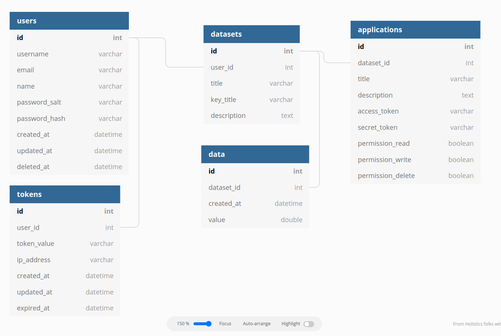

# Database Structure

```
Table users {
  id int [pk, increment]
  username varchar [not null, unique]
  email varchar [not null, unique]
  name varchar [not null]
  password_salt varchar [not null]
  password_hash varchar [not null]
  created_at datetime
  updated_at datetime
  deleted_at datetime
}

Table tokens {
  id int [pk, increment]
  user_id int
  token_value varchar [not null, unique]
  ip_address varchar [not null]
  created_at datetime
  updated_at datetime
  expired_at datetime
}

Table datasets {
  id int [pk, increment]
  user_id int
  title varchar [not null]
  key_title varchar [not null]
  description text
}

Table applications {
  id int [pk, increment]
  dataset_id int
  title varchar [not null]
  description text
  access_token varchar [not null]
  secret_token varchar [not null]
  permission_read boolean [not null]
  permission_write boolean [not null]
  permission_delete boolean [not null]
}

Table data {
  id int [pk, increment]
  dataset_id int [not null]
  created_at datetime [not null]
  value double [not null]
}

Ref: tokens.user_id > users.id
Ref: datasets.user_id > users.id
Ref: data.dataset_id > datasets.id
Ref: applications.dataset_id > datasets.id
```

